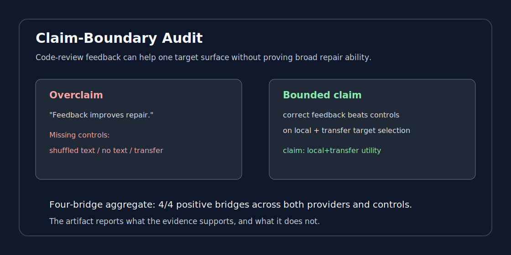

# Claim-Boundary Audit

Claim-Boundary Audit is a small evaluation artifact for code-review feedback
claims.



It asks a narrow evaluation question:

> When code-review feedback appears helpful, what claim is actually warranted:
> local target recovery, transfer target selection, feedback-text sensitivity, or
> no supported target-selection claim?

The repository contains a minimal runnable smoke artifact plus an aggregate
four-bridge result card. Its purpose is to keep code-review feedback claims
bounded: local target recovery, transfer target selection, text sensitivity, or
hold.

## Quick Start

Run the minimal claim-boundary smoke test:

```bash
make smoke
make public-check
```

This runs two lightweight checks:

1. a synthetic protocol smoke test over `data/sample_claim_boundary_records.jsonl`;
2. a cached aggregate-card render from
   `paper_results/four_bridge_positive_meta_summary.json`.

It writes:

```text
docs/result_cards/sample_claim_boundary_card.md
docs/result_cards/sample_claim_boundary_metrics.json
docs/result_cards/four_bridge_positive_meta_card.md
```

You can also run the scorer directly:

```bash
python scripts/score_claim_boundary.py \
  data/sample_claim_boundary_records.jsonl \
  --card docs/result_cards/sample_claim_boundary_card.md \
  --json docs/result_cards/sample_claim_boundary_metrics.json
```

The sample is synthetic and intentionally small. Its purpose is to demonstrate
the protocol and file format, not to reproduce a full benchmark.

See [quick demo](docs/quick_demo.md) for a compact result summary.

## Artifact Shape

```text
data/
  README.md
  sample_claim_boundary_records.jsonl
paper_results/
  four_bridge_positive_meta_summary.json
scripts/
  README.md
  run_smoke_test.sh
  score_claim_boundary.py
  render_positive_bridge_card.py
docs/
  source_licenses.md
  quick_demo.md
  result_cards/
```

## Claim Labels

The scorer reports bounded labels:

- `correct-feedback-specific local+transfer utility`: correct feedback beats
  both shuffled-feedback and no-feedback controls on both local and transfer
  stages.
- `correct-feedback-specific local utility`: the above holds on local target
  recovery only.
- `feedback-text sensitivity`: correct feedback beats shuffled feedback but not
  no-feedback.
- `text-presence utility`: correct feedback beats no-feedback but not shuffled
  feedback.
- `hold`: the smoke data do not support a positive claim.

These labels are audit decisions about a fixed target-selection surface. They
are not deployment, patch-repair, or human-understanding claims.

## Public-Release Rule

Before adding larger data or outputs, keep these gates true:

1. The package has no local paths, credentials, private workspace notes, or
   reviewer-internal status files.
2. Each claimed script/output in the README exists and runs, or the claim is
   removed.
3. Dataset licenses/source terms are recorded for each included source family.
